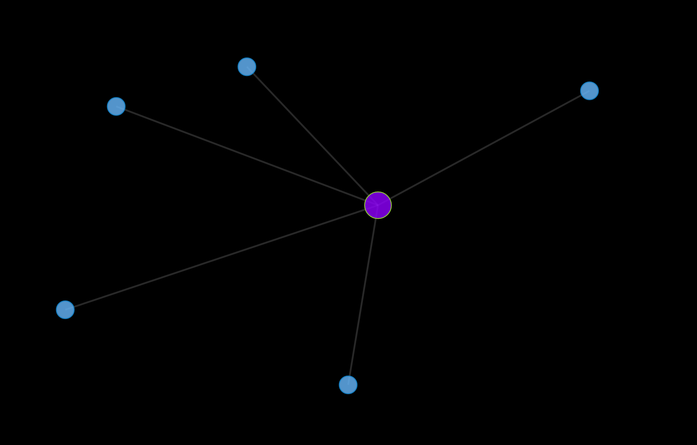
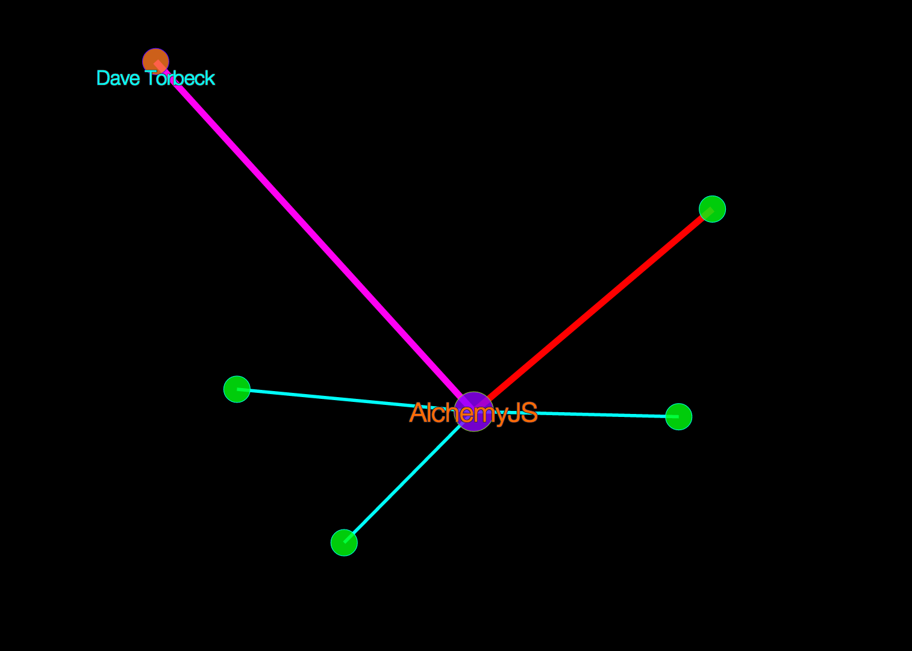

## GraphStyling

Alchemy.js uses simple and intuitive configuration options to define graph styling.

Some of the different ways the graph is *styled* in [alchemy.conf](#Configuration): 

### Alchemy.conf properties that affect Graph Styling

  * [nodeStyle](#nodeStyle)
  * [edgeStyle](#edgeStyle)
  * [rootNodeRadius](#rootnoderadius)
  * [graphHeight](#graphheight)
  * [graphWidth](#graphwidth)
  * [clusterColors](#clustercolors)

CSS can be used to style the svg elements on the graph in tandem with [nodeStyle](#nodeStyle) and [edgeStyle](#edgeStyle), though this is usually unnecessary.
The `nodeStyle` and `edgeStyle` keys include options to base styling around both data and user interactions, and as such are more more powerful, flexible, and dynamic.

### Styling the graph using node and edge types

All forms of styling can be assigned based on [nodeType](#nodetype) and [edgeType](#edgetype) which are defined in your configuration. Below is a short example to give you an idea of the possibilities. As always, check out the [examples gallery](/#/examples) for full examples.

### Sample Data

The following data source of Alchemy.js contributors would, by default, result in the graph viz that follows:

~~~ json
{
    "comment": "AlchemyJS contributors",
    "nodes": [
        {
            "id": 0,
            "caption": "AlchemyJS",
            "role": "project",
            "root": true
        },
        {
            "id": 1,
            "caption": "Huston Hedinger",
            "github": "hustonhedinger",
            "role": "Maintainer",
            "fun_fact": "hooligan"
        },
        {
            "id": 2,
            "caption": "Grace Andrews",
            "github": "Grace-Andrews",
            "role": "Maintainer",
            "fun_fact": "was born left handed, now right handed."
        },
        {
            "id": 3,
            "caption": "Isabella Jorissen",
            "github": "ifjorissen",
            "role": "Maintainer",
            "fun_fact": "knows a lot of digits of pi. Also loves pie."
        },
        {
            "id": 4,
            "caption": "Matt Cox",
            "github": "MDCox",
            "role": "Maintainer",
            "fun_fact": "is not fun"
        },
        {
            "id": 5,
            "caption": "Dave Torbeck",
            "github": "DaveTorbeck",
            "role": "Contributor",
            "fun_fact": ""
        }
    ],
    "edges": [
        {
            "source": 1,
            "target": 0,
            "caption": "Maintains"
        },
        {
            "source": 2,
            "target": 0,
            "caption": "Maintains"
        },
        {
            "source": 3,
            "target": 0,
            "caption": "Maintains"
        },
        {
            "source": 4,
            "target": 0,
            "caption": "Often Breaks"
        },
        {
            "source": 5,
            "target": 0,
            "caption": "contributes"
        }
    ]
}
~~~ 

### Default Visualization 

    

### Overriding Default Styles

To give the graph some classes we can play with, define the node types and edge types in your conf.  For our sample data, you might end up with something like the following:

~~~ json
var conf = {
    "dataSource": "sample_data/contrib.json",
    "nodeTypes": {"role": ["Maintainer",
                           "Contributor",
                           "project"]},
    "edgeTypes": {"caption": ["Maintains",
                              "Contributes"]},
    "nodeStyle": {
        "project": {
            color: "#00ff0e",
        },
        "Maintainer":{
            color: "#00ff0e",
            borderColor: "#00ffda"
        },
        "Contributor": {
            color: "#ff7921",
            borderColor: "#4f07ff"
        }
    },
    "edgeStyle": {
        "Maintains": {
            color: "#00fffa",
            width: 5
        },
        "contributes": {
            color: "#ff00f3",
            borderWidth: 10
        }
    }

};
alchemy.begin(conf)
~~~

###Styling with CSS
Styling through CSS tends to be inflexible, as it's not related to the data in any way.  However, some people may want to use an obscure feature offered by SVG/CSS, and we've made sure that that is easy to do. The svg elements of the nodes and edges receive classes that correspond to the types defined in the configuration options `edgeTypes` and `nodeTypes`. To create the same graph with css you can assign css styles based on those classes.  Based on our data and this example we can use this css to generate the graph that follows:

~~~ css
        /* Nodes */
        .Maintainer circle {
            fill: #00ff0e;
            stroke: #00ffda;
        }

        .Contributor circle {
            fill: #ff7921;
            stroke: #4f07ff;
        }
        
        /* Node Captions */
        .Contributor text {
            display: block;
            font-size: 30px;
            fill: #00fff7;
        }

        /* Root Node Caption */
        .root.project text {
            display: block;
            font-size: 40px;
            fill: #ff6e00;
        }

        /* Edges */
        line.Maintains {
            stroke: #00fffa;
            stroke-width: 5px;
            stroke-opacity: 1;
        }

        line.Often.Breaks{
            stroke: #ff0000;#ff00f3;
            stroke-width: 10px;
            stroke-opacity: 1;
        }

        line.contributes {
            stroke: #ff00f3;
            stroke-width: 10px;
            stroke-opacity: 1;
        }
~~~

____
