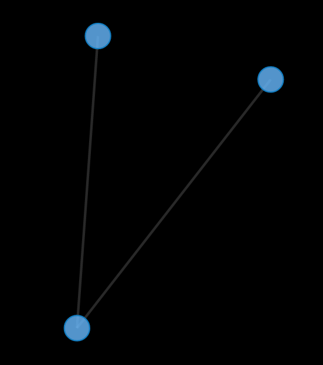

## Philosophy

Alchemy.js is a graph drawing application built almost entirely in <a href="http://d3js.org/">d3</a>.

Alchemy.js was built so that developers could easily get up and running with graph visualization applications, without much over head.  Minimal code is actually required to generate Alchemy.js graphs with most projects. Most customization of the application takes place by overriding default configurations, rather than direct implementation via JavaScript.

Additionally, because Alchemy.js is built with <a href="http://d3js.org/">d3</a>, the core application can easily be extended with any of the other features included in <a href="http://d3js.org/">d3</a>.
  
 

## Quick Start

Alchemy.js requires three things, **alchemy.css**, **alchemy.js**, and **data**.  Additionally, Alchemy requires CSS, JavaScript, and font dependencies.  These dependencies with version numbers can be found in the [bower.json file](https://github.com/GraphAlchemist/Alchemy/blob/master/bower.json){:target="_blank"} on GitHub, can be loaded via the vendor.js and vendor.css files as outlined below, and are listed here:

* [jQuery](http://jquery.com/)
* [d3](http://d3js.org/)
* [Lo-Dash](http://lodash.com/)
* [Bootstrap](http://getbootstrap.com/) (for the control dash)
* [Font Awesome](http://fortawesome.github.io/Font-Awesome/) (for the control dash)

The following are three different ways to get started with Alchemy.js.

### Use The Alchemy Content Delivery Network

1. Include the CDNs

    >> ~~~ html
    >> <link rel="stylesheet" href="http://cdn.graphalchemist.com/alchemy.min.css">
    >> ...
    >> 
    >> ~~~
    >>
    

>> **Be amazed.**    
>> 

### Download and include Alchemy.js:  

~~~ html
<link rel="stylesheet" type="text/css" href="path/to/vendor.css">
<link rel="stylesheet" href="path/to/alchemy.css">
<script type="text/javascript" src="path/to/vendor.js">
<script type="text/javascript" src="path/to/alchemy.js">
~~~
  
Repeat from above:   

* **Add an element with "alchemy" as the id and class**    
* **Provide Alchemy.js with a graphJSON dataSource.**    
* **start Alchemy.js.**    
* **Be amazed.**  
   
  

### Install with Bower
Alchemy.js itself is a yeoman project and can easily be installed with bower.

~~~ bash
bower install alchemyjs --save
~~~
 

## Next Steps
Alchemy.js relies on a flexible and open data format called **[GraphJSON](#GraphJSON)** and can do a lot more than draw small graphs.  Alchemy.js includes a large and growing set of default configurations that can be easily overridden.  Check out the **[configuration](#Configuration)** documentation to learn about all of the ways Alchemy.js can be configured out of the box.

____
